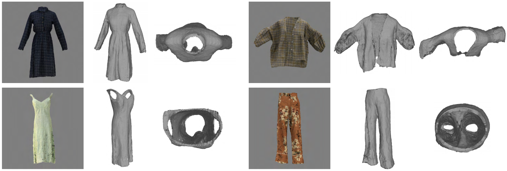

## Learning Anchored Unsigned Distance Functions with Gradient Direction Alignment for Single-view Garment Reconstruction (ICCV 2021 Oral)

This repository contains the code for the paper:

**[Learning Anchored Unsigned Distance Functions with Gradient Direction Alignment for Single-view Garment Reconstruction](https://arxiv.org/abs/2108.08478)** <br>*Fang Zhao, Wenhao Wang, Shengcai Liao and Ling Shao* <br>



### Requirements
- Cuda 9.2
- Python 3.7
- Pytorch 1.6
- [ChamferDistancePytorch](https://github.com/ThibaultGROUEIX/ChamferDistancePytorch)

To install all python dependencies for this project:
```
conda env create -f env_anchor_udf.yml
conda activate AnchorUDF
```

### Dataset

- [Deep Fashion3D](https://github.com/kv2000/deepFashion3D)

We provide the [preprocessed data](https://drive.google.com/drive/folders/1gXDlPGYYVad8IkFo_gxd-NOcFEgomwT0?usp=sharing) used for model training and evaluation. You can prepare your own data by following the data generation steps of [PIFu](https://github.com/shunsukesaito/PIFu).

### Demo

To do a quick test, download the [trained models](https://drive.google.com/drive/folders/1iFYoaqabmd86J4fB87ICPmfMoBX5nlkA?usp=sharing) and run:

```
python -m apps.eval --results_path {path_of_output} --name {folder_of_output} --dataroot {path_of_dataset} --test_folder_path {folder_of_test_data, e.g., 290-1} --load_netG_checkpoint_path ./checkpoints/anchor_udf_df3d/netG_epoch_59 --anchor --num_steps 5 --filter_val 0.007
```
For the HD version:
```
python -m apps.eval_hd --results_path {path_of_output} --name {folder_of_output} --dataroot {path_of_dataset} --test_folder_path {folder_of_test_data, e.g., 290-1} --load_netMR_checkpoint_path ./checkpoints/anchor_udf_hd_df3d/netMR_epoch_14 --anchor --merge_layer 2 --joint_train --loadSize 1024 --num_steps 5 --filter_val 0.007
```
Optionally, you can remove outliers by statistical outlier removal:
```
python -m apps.remove_outlier --file_path {path_of_file} --nb_neighbors 5 --std_ratio 10.0
```

### Training

To generate targets for training:
```
python -m apps.gen_targets --dataroot {path_of_dataset} --sigma {0.003, 0.02, or 0.08} --point_num 600
```

To train the model:
- First run:
```
python -m apps.train --dataroot {path_of_dataset} --random_flip --random_scale --random_trans --anchor --learning_rate 5e-5 --batch_size 4 --name {path_of_saved_model} --schedule 40 --num_epoch 50
```
- Then add gradient direction alignment:
```
python -m apps.train --dataroot {path_of_dataset} --random_flip --random_scale --random_trans --anchor --learning_rate 5e-6 --batch_size 4 --num_sample_inout 2000 --name {path_of_saved_model} --grad_constraint --backbone_detach --no_num_eval --continue_train --resume_epoch 49 --num_epoch 60
```

### Evaluation

To evaluate the model:
- Obtain reconstruction results on the test set:
```
python -m apps.eval_all --dataroot {path_of_dataset} --results_path {path_of_output} --load_netG_checkpoint_path {path_of_model} --anchor --num_steps 5 --filter_val 0.007
```
- Compute Chamfer and P2S errors:
```
python -m apps.compute_errors --root_path {path_of_dataset} --results_path {path_of_output}
```

### Acknowledgement

Our code is based on [PIFu](https://github.com/shunsukesaito/PIFu) and [NDF](https://github.com/jchibane/ndf). We thank the authors for their excellent work!

### Citation
If you use this code for your research, please consider citing:
```
@inproceedings{zhao2021learning,
  title={Learning Anchored Unsigned Distance Functions with Gradient Direction Alignment for Single-view Garment Reconstruction},
  author={Zhao, Fang and Wang, Wenhao and Liao, Shengcai and Shao, Ling},
  booktitle={Proceedings of the IEEE/CVF International Conference on Computer Vision},
  pages={12674--12683},
  year={2021}
}
```

